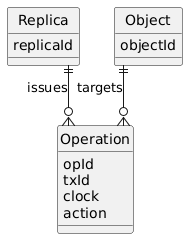
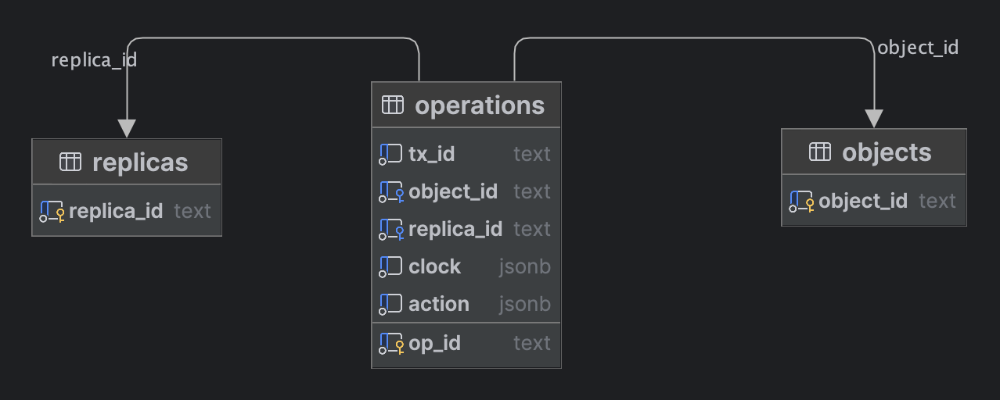

# PostgreSQL Storage Sandbox

This environment starts a standalone PostgreSQL instance for relational modeling of CRDT operation logs.

## Start

```bash
docker compose -f infra/postgresql/compose.yaml up -d
```

## Stop

```bash
docker compose -f infra/postgresql/compose.yaml down
```

## Connection

- host: `localhost`
- port: `55432`
- database: `crdt_lab`
- user: `crdt`
- password: `crdt`

## Schema Highlights

- `replicas`: registry of logical replicas
- `objects`: registry of CRDT root object identifiers
- `operations`: immutable operation log with `clock` and `action` stored in JSONB form

The initialization SQL lives in `initdb/001_schema.sql`.

## Review Plan

This file is the working checklist for the PostgreSQL part of the database assignment.

### Status

- `DONE`: align the physical schema with the actual CRDT library model
- `TODO`: document the logical model for PostgreSQL
- `TODO`: prepare ER diagram
- `TODO`: prepare migration description
- `TODO`: define the list of benchmark and analysis queries
- `TODO`: run `EXPLAIN ANALYZE` for key queries
- `TODO`: write the final PostgreSQL conclusions

## 1. Goal And Scope

PostgreSQL рассматривается как базовая СУБД для первого этапа обзора, поскольку это зрелая open-source реляционная система с большим сообществом, хорошей документацией и предсказуемым поведением при проектировании схемы. Для задачи хранения CRDT-операций это важно, потому что PostgreSQL позволяет явно фиксировать структуру данных, связи между сущностями, ограничения целостности и индексную стратегию, а значит хорошо подходит для академического анализа схемы хранения.

Дополнительные причины выбора PostgreSQL:

- популярное и широко применяемое open-source решение, для которого легко найти литературу, примеры и практики проектирования;
- строгая схема и развитый механизм ограничений позволяют формализовать инварианты предметной области;
- поддержка `JSONB` дает возможность сочетать реляционную модель с полу-структурированными данными там, где полная нормализация может быть избыточной;
- развитый инструментарий анализа запросов, включая `EXPLAIN ANALYZE`, позволяет обосновывать выбор индексов и структуры хранения не только логически, но и экспериментально;
- PostgreSQL удобно использовать как референсную реализацию, с которой затем можно сравнивать документные и другие модели хранения.

В рамках данного раздела PostgreSQL рассматривается как СУБД для хранения pure operation-based CRDT-представления композитных объектов. Основная идея состоит в том, что текущее состояние объекта не хранится как единственная изменяемая запись, а восстанавливается на основе журнала операций, где каждая операция содержит снимок векторных часов и сериализованное действие.

В PostgreSQL сохраняются следующие сущности:

- replicas
- CRDT root objects
- operations
- vector clocks

В терминах текущей схемы этим сущностям соответствуют таблицы:

- `replicas` — логические реплики, от имени которых выпускаются операции;
- `objects` — реестр корневых CRDT-объектов;
- `operations` — неизменяемый журнал операций над объектами, включая поля `clock` и `action`.

Часть структуры приходит непосредственно из модели библиотеки:

- идентификатор реплики;
- идентификатор объекта;
- идентификатор операции;
- идентификатор транзакции;
- действие над объектом;
- векторные часы.

Отдельные сущности для зависимостей между операциями в текущей версии схемы не вводятся, так как библиотека не хранит явный граф зависимостей. Частичный порядок операций задается сравнением векторных часов.

Производными элементами на уровне хранения в текущей миграции остаются только:

- таблица `replicas` как отдельный реестр идентификаторов реплик;
- таблица `objects` как отдельный реестр идентификаторов объектов;
- индексные структуры, необходимые для поддержки типовых запросов и анализа производительности.

## 2. Logical Data Model

Логическая модель данных в текущем варианте строится вокруг immutable operation log. База данных не хранит “итоговое состояние” объекта как единственную актуальную запись, а сохраняет множество операций, на основе которых состояние может быть восстановлено средствами библиотеки. Минимальный логический набор сущностей соответствует текущему контракту библиотеки и включает реплики, корневые объекты и операции.

На логическом уровне модель задается следующими сущностями:

- `Replica` — источник операций, представляющий отдельную логическую реплику;
- `Object` — корневой CRDT-объект, над которым выполняются операции;
- `Operation` — атомарное неизменяемое изменение, выпущенное конкретной репликой для конкретного объекта.

Связи между сущностями:

- одна `Replica` может породить много `Operation`;
- один `Object` может иметь много `Operation`;
- каждая `Operation` принадлежит ровно одной `Replica`;
- каждая `Operation` относится ровно к одному `Object`.

Ключевой особенностью модели является то, что причинно-следственная информация не выносится в отдельную сущность. Она хранится внутри самой операции в поле `clock`, представляющем снимок векторных часов на момент выпуска операции.

- `replicas`
- `objects`
- `operations`

Роль таблиц в текущей логической модели:

- `replicas` хранит допустимые идентификаторы реплик и выступает справочником источников операций;
- `objects` хранит идентификаторы корневых объектов, для которых ведется история изменений;
- `operations` хранит сам журнал изменений и является центральной таблицей схемы.

Таблица `operations` логически содержит:

- идентификатор самой операции;
- идентификатор транзакции, в рамках которой операция была создана;
- ссылку на объект;
- ссылку на реплику;
- снимок векторных часов;
- сериализованное действие.

Отображение модели библиотеки `Operation` в PostgreSQL является почти прямым:

- `Operation.opId -> operations.op_id`
- `Operation.txId -> operations.tx_id`
- `Operation.objectId -> operations.object_id`
- `Operation.replicaId -> operations.replica_id`
- `Operation.clock -> operations.clock`
- `Operation.action -> operations.action`

Поскольку библиотека использует строковые идентификаторы, логическая модель БД также исходит из строковой природы `opId`, `txId`, `objectId` и `replicaId`, а не из искусственного перехода к `UUID`.

Поле `clock` в логической модели интерпретируется как отображение вида `replicaId -> counter`, необходимое для установления частичного порядка операций.

Поле `action` в логической модели интерпретируется как сериализованная команда изменения CRDT-объекта, включающая тип действия и его параметры, например путь, значение или индекс.

Открытые проектные решения для текущей логической модели:

- identifier types: fixed as `TEXT` to match the library format
- vector clock storage: current choice is `JSONB`
- action storage: current choice is `JSONB`
- whether snapshots should be added later as an optimization layer

## 3. ER Diagram

ER-диаграмма фиксирует логическую модель данных без привязки к конкретной реализации в PostgreSQL. Ее задача — показать, какие сущности существуют в предметной области и как они связаны между собой на концептуальном уровне.



На логической ER-диаграмме отражены:

- сущность `Replica` как источник операций;
- сущность `Object` как корневой CRDT-объект;
- сущность `Operation` как атомарная запись в журнале изменений;
- связь `1:N` между `Replica` и `Operation`;
- связь `1:N` между `Object` и `Operation`;
- логические атрибуты операции: `opId`, `txId`, `clock`, `action`.

Интерпретация диаграммы:

- каждая операция создается одной конкретной репликой;
- каждая операция относится к одному конкретному корневому объекту;
- одна реплика может породить много операций;
- один объект может иметь длинную историю операций;
- причинно-следственная информация не выделяется в отдельную сущность, а выражается через поле `clock` внутри операции.

Таким образом, ER-диаграмма соответствует текущему состоянию библиотеки: отдельная сущность зависимостей между операциями отсутствует, поскольку порядок и сравнение операций определяются через векторные часы, встроенные в саму операцию. В диаграмме намеренно не указываются PostgreSQL-специфичные типы `TEXT` и `JSONB`, так как они относятся уже к физическому уровню проектирования.

Artifact:

- `resources/er.puml` — исходник диаграммы в `PlantUML`
- `resources/diagram.png` — экспортированное изображение диаграммы

## 4. Physical Schema And Migration

Физическая схема показывает, как логическая модель реализована именно в PostgreSQL. В отличие от ER-диаграммы, здесь фиксируются реальные имена таблиц и колонок, типы данных, первичные и внешние ключи, а также ограничения, заданные в миграции.



Текущая физическая схема строится вокруг трех таблиц:

- `replicas`
- `objects`
- `operations`

Current migration:

- `initdb/001_schema.sql`

Порядок создания объектов в миграции выбран следующим образом:

- сначала создается таблица `replicas`, так как на нее ссылаются операции;
- затем создается таблица `objects`, так как на нее также ссылаются операции;
- после этого создается таблица `operations`, содержащая внешние ключи на `replicas` и `objects`;
- в конце создаются индексы для типовых сценариев чтения и фильтрации операций.

Выбор типов данных в физической схеме обусловлен текущим контрактом библиотеки:

- идентификаторы хранятся как `TEXT`, поскольку библиотека использует строковые значения вида `A:1`, `A:tx:1` и не опирается на `UUID`;
- поле `clock` хранится как `JSONB`, поскольку в библиотеке это отображение `replicaId -> counter`, естественно сериализуемое в JSON-объект;
- поле `action` хранится как `JSONB`, поскольку конкретная структура действия зависит от его типа и включает разные наборы полей;
- `object_id` и `replica_id` оформлены как внешние ключи, чтобы физическая схема явно поддерживала ссылочную целостность.

На уровне ограничений миграция сейчас фиксирует:

- первичные ключи на всех трех таблицах;
- внешние ключи из `operations` в `replicas` и `objects`;
- `CHECK`-ограничение, требующее, чтобы `clock` был JSON-объектом;
- `CHECK`-ограничение, требующее, чтобы `action` был JSON-объектом;
- `CHECK`-ограничение на наличие поля `type` внутри `action`.

## 5. Normalization And Data Integrity

С точки зрения нормализации текущая схема представляет собой частично нормализованную модель хранения. На реляционном уровне из общей структуры данных выделены самостоятельные сущности `Replica`, `Object` и `Operation`, между которыми установлены явные связи через внешние ключи. Такой уровень декомпозиции достаточен для отделения независимых идентификаторов реплик и объектов от журнала операций и для устранения дублирования этих сущностей в отдельных таблицах.

Если рассматривать только реляционную часть схемы, не раскрывая внутреннюю структуру полей `clock` и `action`, то текущие отношения можно считать как минимум удовлетворяющими требованиям третьей нормальной формы. В таблицах `replicas` и `objects` все неключевые зависимости тривиальны, а в таблице `operations` атрибуты зависят от ключа операции и не образуют очевидных транзитивных зависимостей через другие неключевые столбцы.

При этом для всей схемы в строгом классическом смысле корректнее говорить не о “полной 3НФ для всех данных”, а о частично нормализованной модели, поскольку значимая часть структуры операции намеренно сохранена внутри `JSONB`-полей. Поэтому в отчете корректно фиксировать, что реляционный каркас схемы соответствует 3НФ, а вложенные данные `clock` и `action` не подвергаются дальнейшей нормализации сознательно.

Наиболее очевидно нормализованными являются таблицы:

- `replicas`, содержащая только идентификатор реплики;
- `objects`, содержащая только идентификатор корневого объекта;
- `operations`, содержащая операции как самостоятельные записи, связанные с репликой и объектом по ссылкам, а не через повторяющиеся неструктурированные поля.

В текущей схеме при этом сознательно не выполняется дальнейшая декомпозиция полей `clock` и `action` на отдельные отношения. Это является не недостатком схемы, а осознанным компромиссом между строгой реляционной нормализацией и соответствием фактическому контракту библиотеки.

Причины такого решения:

- библиотека уже рассматривает операцию как цельный объект, включающий `clock` и `action`;
- векторные часы естественно представляются как ассоциативная структура `replicaId -> counter`, которую удобно хранить как JSON-объект;
- действие `action` имеет вариативную структуру в зависимости от типа операции, поэтому его избыточная декомпозиция усложнила бы схему без явной пользы на текущем этапе;
- основной целью данного этапа является исследование корректного и минимально избыточного хранения operation log, а не построение максимально глубоко декомпозированной схемы.

Таким образом, текущую модель можно охарактеризовать как нормализованную на уровне основных сущностей и намеренно частично денормализованную на уровне внутреннего содержимого операции.

Гарантии целостности, обеспечиваемые PostgreSQL:

- primary keys
- foreign keys
- check constraints
- cascade policies

В терминах текущей схемы это означает следующее:

- `PRIMARY KEY` гарантируют уникальность каждой реплики, каждого объекта и каждой операции;
- `FOREIGN KEY` гарантируют, что операция не может ссылаться на несуществующую реплику или несуществующий объект;
- `ON DELETE CASCADE` для связи `operations -> objects` обеспечивает согласованное удаление истории операций при удалении объекта;
- `CHECK (jsonb_typeof(clock) = 'object')` гарантирует, что поле `clock` хранится именно как JSON-объект;
- `CHECK (jsonb_typeof(action) = 'object')` гарантирует, что поле `action` хранится именно как JSON-объект;
- `CHECK (action ? 'type')` гарантирует наличие базового дискриминатора типа действия.

При этом часть инвариантов не может быть полностью обеспечена одной только схемой PostgreSQL и остается ответственностью прикладного уровня:

- корректность содержимого векторных часов как структуры причинности;
- допустимость и формат значений внутри `clock`;
- соответствие структуры `action` конкретному значению `action.type`;
- корректность полей `path`, `index`, `value` и других параметров действия;
- правила генерации `opId` и `txId` в формате, принятом библиотекой;
- семантика порядка операций, определяемая сравнением векторных часов.

Следовательно, разделение ответственности выглядит так: PostgreSQL обеспечивает базовую структурную и ссылочную целостность, а библиотека обеспечивает доменную корректность CRDT-операций и их причинно-следственную интерпретацию.

## 6. Main Query Scenarios

Для текущей схемы типовые запросы должны покрывать как базовые операции чтения журнала, так и сценарии вставки новых CRDT-операций. Поскольку физическая модель пока минимальна, основной фокус делается на выборках из `operations` по объекту, транзакции, реплике и типу действия.

Ниже приведен базовый набор запросов, который можно использовать как основу для дальнейшего анализа индексов и выполнения `EXPLAIN ANALYZE`.

### 6.1 Full Operation History For Object

Назначение: получить полную историю операций для конкретного корневого объекта.

Ожидаемая кардинальность результата: от нескольких строк до всей истории одного объекта.

```sql
SELECT
    op_id,
    tx_id,
    object_id,
    replica_id,
    clock,
    action
FROM operations
WHERE object_id = :object_id
ORDER BY op_id;
```

Этот запрос является базовым сценарием replay, поскольку библиотека восстанавливает состояние объекта из набора операций.

### 6.2 Operations For Transaction

Назначение: получить все операции, входящие в конкретную транзакцию.

Ожидаемая кардинальность результата: обычно небольшое число строк, соответствующее количеству операций в одной транзакции.

```sql
SELECT
    op_id,
    tx_id,
    object_id,
    replica_id,
    clock,
    action
FROM operations
WHERE tx_id = :tx_id
ORDER BY op_id;
```

Этот сценарий полезен для анализа того, как библиотека группирует связанные изменения внутри одного `TransactionRecord`.

### 6.3 Operations Issued By Replica

Назначение: получить операции, выпущенные конкретной репликой.

Ожидаемая кардинальность результата: от нескольких строк до значительной части журнала при активной реплике.

```sql
SELECT
    op_id,
    tx_id,
    object_id,
    replica_id,
    clock,
    action
FROM operations
WHERE replica_id = :replica_id
ORDER BY op_id;
```

Такой запрос позволяет анализировать активность отдельной реплики и может использоваться для отладки синхронизации.

### 6.4 Inspect Vector Clock For Operation

Назначение: получить снимок векторных часов, сохраненный вместе с конкретной операцией.

Ожидаемая кардинальность результата: одна строка.

```sql
SELECT
    op_id,
    clock
FROM operations
WHERE op_id = :op_id;
```

Этот запрос важен для проверки причинного контекста конкретной операции и для последующего анализа того, как библиотека упорядочивает операции.

### 6.5 Insert New Operation

Назначение: сохранить новую операцию, предварительно обеспечив наличие соответствующей реплики и объекта.

Ожидаемая кардинальность результата: одна вставленная строка в `operations`, при необходимости по одной строке в `replicas` и `objects`.

```sql
INSERT INTO replicas (replica_id)
VALUES (:replica_id)
ON CONFLICT (replica_id) DO NOTHING;

INSERT INTO objects (object_id)
VALUES (:object_id)
ON CONFLICT (object_id) DO NOTHING;

INSERT INTO operations (
    op_id,
    tx_id,
    object_id,
    replica_id,
    clock,
    action
) VALUES (
    :op_id,
    :tx_id,
    :object_id,
    :replica_id,
    CAST(:clock AS JSONB),
    CAST(:action AS JSONB)
);
```

Это основной сценарий записи данных в БД при сохранении операции, сформированной библиотекой.

### 6.6 Query Operations By Action Type

Назначение: получить операции определенного типа действия, например все `field.set` или все `array.insert`.

Ожидаемая кардинальность результата: зависит от распределения типов действий в журнале.

```sql
SELECT
    op_id,
    tx_id,
    object_id,
    replica_id,
    action
FROM operations
WHERE action ->> 'type' = :action_type
ORDER BY op_id;
```

Этот запрос полезен для аналитических сценариев и для обоснования индекса по типу действия.

### 6.7 Query Operations By Payload Fragment

Назначение: искать операции по содержимому `action`, если требуется отобрать действия с определенным фрагментом JSON.

Ожидаемая кардинальность результата: обычно выборочная подвыборка журнала.

```sql
SELECT
    op_id,
    tx_id,
    object_id,
    replica_id,
    action
FROM operations
WHERE action @> CAST(:action_fragment AS JSONB)
ORDER BY op_id;
```

Этот сценарий нужен в первую очередь для исследовательских и диагностических запросов, когда требуется найти операции по частичному шаблону данных.

## 7. Indexing Strategy

Индексная стратегия в текущей схеме строится вокруг основных сценариев доступа к журналу операций. Поскольку таблицы `replicas` и `objects` состоят только из первичных ключей, дополнительная индексная настройка для них на данном этапе не требуется. Основная работа по оптимизации приходится на таблицу `operations`.

В текущей миграции уже созданы следующие индексы:

- `idx_operations_object_id`
- `idx_operations_replica_id`
- `idx_operations_tx_id`
- `idx_operations_action_type`
- `idx_operations_clock_gin`
- `idx_operations_action_gin`

Ниже приведено назначение каждого индекса и его связь с типовыми запросами.

### 7.1 Index `idx_operations_object_id`

Целевой сценарий:

- `6.1 Full Operation History For Object`

Назначение индекса:

- ускоряет фильтрацию по `object_id` при выборке всей истории конкретного объекта.

Обоснование:

- запрос по объекту является одним из базовых сценариев replay;
- индекс по одному столбцу достаточен, потому что фильтрация выполняется по точному равенству `object_id`.

### 7.2 Index `idx_operations_replica_id`

Целевой сценарий:

- `6.3 Operations Issued By Replica`

Назначение индекса:

- ускоряет выборку операций, выпущенных конкретной репликой.

Обоснование:

- операции по реплике нужны для анализа активности источника изменений и для диагностических сценариев;
- фильтрация выполняется по точному равенству `replica_id`, поэтому достаточно обычного B-tree индекса по одному полю.

### 7.3 Index `idx_operations_tx_id`

Целевой сценарий:

- `6.2 Operations For Transaction`

Назначение индекса:

- ускоряет поиск всех операций, принадлежащих одной транзакции.

Обоснование:

- транзакция в библиотеке объединяет небольшую группу связанных операций;
- для выборки по `tx_id` достаточно стандартного B-tree индекса, так как используется фильтрация по точному значению.

### 7.4 Index `idx_operations_action_type`

Целевой сценарий:

- `6.6 Query Operations By Action Type`

Назначение индекса:

- ускоряет отбор операций по выражению `action ->> 'type'`.

Обоснование:

- тип действия является самым естественным селектором для аналитических выборок по `action`;
- используется выражение по JSONB-полю, поэтому нужен expression index, а не обычный индекс по столбцу `action`.

### 7.5 Index `idx_operations_clock_gin`

Целевые сценарии:

- потенциальные исследовательские запросы по содержимому `clock`
- последующий анализ структуры векторных часов

Назначение индекса:

- ускоряет поиск по JSONB-содержимому поля `clock`, если в дальнейшем потребуется выполнять containment-запросы или другие выборки по фрагментам векторных часов.

Обоснование:

- `clock` хранится как JSONB-объект;
- GIN-индекс является стандартным выбором для JSONB-полей, когда требуется искать по содержимому, а не только по полному равенству значения.

Комментарий:

- на текущем этапе этот индекс скорее исследовательский, чем критически необходимый для базовых сценариев.

### 7.6 Index `idx_operations_action_gin`

Целевые сценарии:

- `6.7 Query Operations By Payload Fragment`
- дополнительные выборки по фрагментам JSON в поле `action`

Назначение индекса:

- ускоряет запросы вида `action @> ...`, где операция ищется по частичному JSON-шаблону.

Обоснование:

- поле `action` имеет вариативную структуру;
- GIN-индекс позволяет эффективно выполнять containment-запросы по JSONB, что особенно полезно для исследовательских и диагностических сценариев.

### 7.7 Primary Key Indexes

Отдельно следует учитывать, что PostgreSQL автоматически создает индексы для первичных ключей:

- `replicas(replica_id)`
- `objects(object_id)`
- `operations(op_id)`

Назначение:

- обеспечивают уникальность и быстрый доступ по идентификатору сущности;
- поддерживают запрос `6.4 Inspect Vector Clock For Operation` через поиск по `op_id`.

### 7.8 Planned Or Optional Index Revisions

На текущем этапе имеющийся набор индексов покрывает основные сценарии, но в дальнейшем возможны уточнения после выполнения `EXPLAIN ANALYZE`.

Потенциальные направления пересмотра:

- добавление составного индекса `(object_id, op_id)` если сортировка истории объекта по `op_id` окажется существенной для производительности;
- пересмотр необходимости `idx_operations_clock_gin`, если запросы по содержимому `clock` окажутся редкими;
- возможное уточнение expression index по `action`, если потребуется часто фильтровать не только по `type`, но и по вложенным полям пути или значения.

## 8. Transaction Isolation Level

Для текущего CRDT-подхода требования к уровню изоляции транзакций действительно могут быть мягче, чем в традиционных системах, где несколько клиентов конкурентно изменяют одну и ту же запись. В данной модели операция не обновляет существующее состояние “на месте”, а добавляется в журнал как новая неизменяемая запись.

Это позволяет считать `READ COMMITTED` основным и практически достаточным уровнем изоляции для большинства сценариев:

- вставка новой операции не требует сериализации конкурентных изменений существующих строк;
- конкуренция между изменениями разрешается на уровне CRDT-логики библиотеки, а не за счет строгих блокировок в БД;
- чтение журнала может происходить при параллельных вставках, поскольку итоговая согласованность достигается при последующей интерпретации операций.

Использование более слабого режима в духе `READ UNCOMMITTED` не дает отдельного практического преимущества, так как PostgreSQL фактически не предоставляет для него существенно иного поведения по сравнению с `READ COMMITTED`.

Более сильные уровни, такие как `REPEATABLE READ` и `SERIALIZABLE`, теоретически возможны, но в текущем варианте схемы обычно избыточны:

- они увеличивают стоимость транзакций;
- дают более строгую согласованность снимка, чем требуется для append-only журнала операций;
- не решают доменные задачи согласования лучше, чем корректная обработка векторных часов и операций на уровне библиотеки.

Следовательно, на текущем этапе разумно рекомендовать `READ COMMITTED` как основной рабочий уровень изоляции.

## 9. EXPLAIN ANALYZE

`TODO`: prepare representative seed data before measuring query plans.

Seed dataset expectations:

- `TODO`: number of replicas
- `TODO`: number of objects
- `TODO`: number of operations

`TODO`: run `EXPLAIN ANALYZE` for the key queries from section 6.

For each measured query:

- `TODO`: include SQL text
- `TODO`: include execution plan
- `TODO`: summarize whether PostgreSQL used an index or a sequential scan
- `TODO`: record timing and bottlenecks
- `TODO`: note whether additional indexes or schema changes are needed

## 10. PostgreSQL Assessment

`TODO`: summarize PostgreSQL advantages for this CRDT workload.

`TODO`: summarize PostgreSQL limitations for this CRDT workload.

`TODO`: assess tradeoffs between strict relational structure and `JSONB`-based flexibility.

`TODO`: state whether PostgreSQL currently looks like the preferred storage model and why.

## 11. Open Questions

- `DONE`: identifiers follow the library string format and are stored as `TEXT`
- `TODO`: should action path be validated more strictly at the DB level
- `TODO`: should vector clock remain embedded as `JSONB` or be normalized later for analysis purposes
- `TODO`: should snapshots be introduced later as an optional optimization layer
- `TODO`: which workload size is sufficient for `EXPLAIN ANALYZE` in the report
